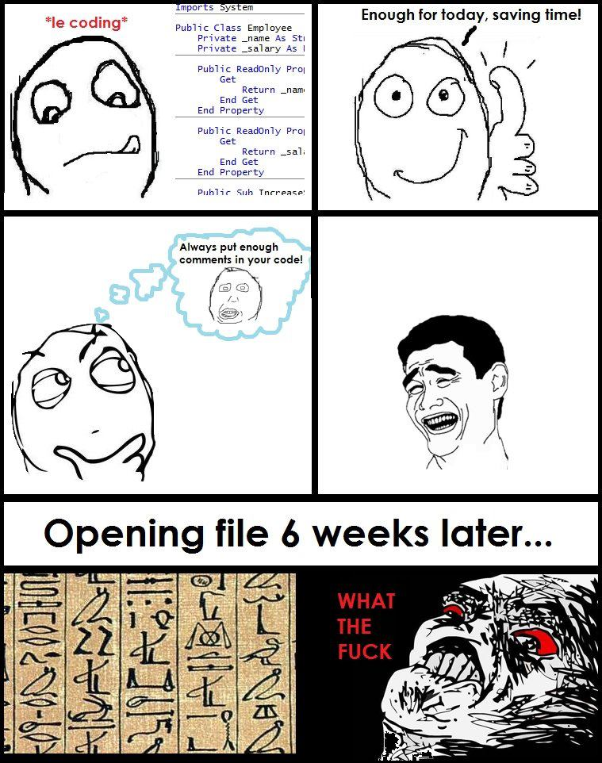

# Recursos varios

## Lógica de programación
Muchos de ustedes quisieran aprender a programar, pero lo encuentran muy difícil. La razón, es que antes de aprender a programar, es conveniente leer un libro que enseñe a pensar algorítmicamente. Se recomienda leer por lo tanto el siguiente libro antes de tratar de aprender a programar. Una vez ustedes lo hayan leído y hecho los ejercicios pueden aprender a programar en MATLAB, PYTHON o en C/C++ en cuestión de días.

Libros recomendados:
* [Trejos, Omar. La esencia de la lógica de programación](http://biblioteca.inu.edu.sv/?wpfb_dl=263)
* [Oviedo, Efrain. Lógica de Programación](http://www.uneweb.com/tutoriales/Logica-de-Programacion-Efrain-Oviedo.pdf) (algunas de las gráficas faltantes del libro se encuentran [aquí](http://books.google.co.ve/books?id=Z_n5lbyJfrQC&pg=PR3&hl=es&source=gbs_selected_pages&cad=2#v=onepage&q&f=false))

## Algunos consejos de cómo programar bien
* [Wilson, Greg et. al. (2014) - Best Practices for Scientific Computing](http://www.plosbiology.org/article/info%3Adoi%2F10.1371%2Fjournal.pbio.1001745)
* [Oualline, Steve (1992) - C elements of style](http://www.oualline.com/style/index.html)

## Programas para primiparos en programación
* <http://pseint.sourceforge.net>
* <http://www.alice.org/index.php>
* <http://dfd.softonic.com>

## Libros gratis de programación en diferentes temas
* <https://github.com/vhf/free-programming-books/blob/master/free-programming-books.md>

## Evalue sus destrezas como programador y encuentre trabajo
* <https://www.hackerrank.com/>
* <http://www.bloomberg.com/news/articles/2016-10-28/wall-street-coders-wanted-elite-college-degrees-not-necessary>

